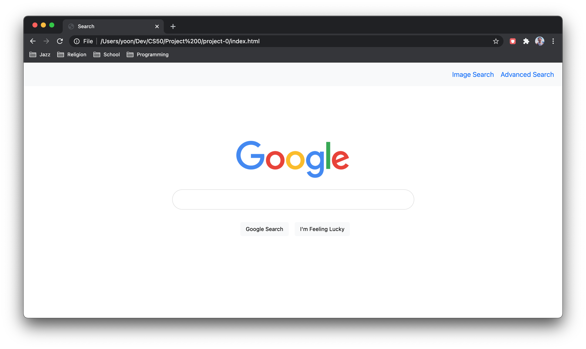

# Google Search Front-End

## Description
This project is a front-end replication of Google Search, Google Image Search, and Google Advanced Search using only HTML and CSS.

- On the Google Search page, there are two links on the upper-right that direct the user to the Image Search and Advanced Search pages. On the other two pages, the link in the upper-right goes back to Google Search.

- Typing a query into the search box and submitting takes the user to Google's own search results. Clicking the "I'm Feeling Lucky" button following a query takes the user to directly to Google's first search result.
